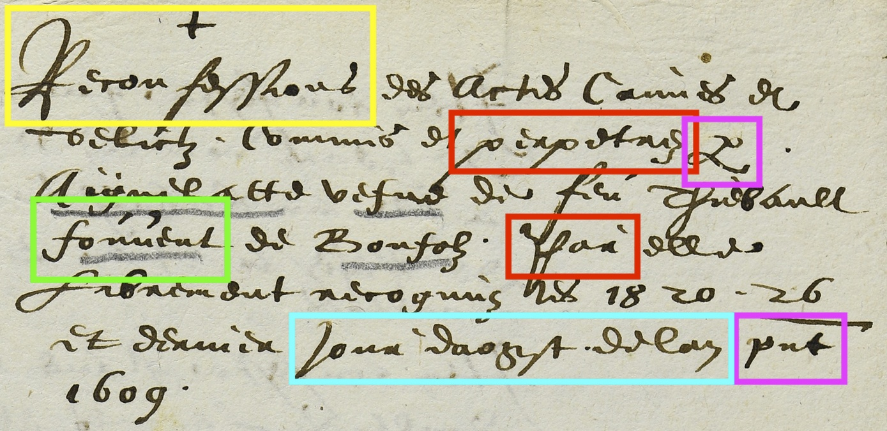
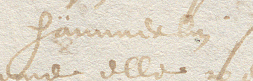
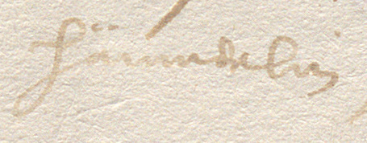

# Corpus du prévôt Farine en français
Corpus en français comprenant images et transcription de procédures criminelles des XVIe et XVIIe siècles de l'ancien Évêché de Bâle. 

L'objectif du corpus est de permettre le développement d'un modèle HTR. 

Ce corpus et les modèles qui en sont issus font l'objet d'une présentation dans le cadre du colloque _Ancient documents and automatic recognition of handwriting. Conference on HTR_, 23-24 juin 2022, École nationale des chartes, Paris. La présentation est disponible [ici](presentation.md). 

## Présentation et contenu du corpus
### Images
Les pièces appartiennent toutes à la série B 168 conservée par les Archives de l'ancien Évêché de Bâle ([accès au plan d'archivage](https://archives-aaeb.jura.ch/detail.aspx?id=77497)).

| Numéro d'inventaire   | Nombre de pages 
| --                    | --
| B 168/15-2.1          | 3 
| B 168/15-2.2          | 11
| B 168/15-2.3          | 4
| B 168/15-2.4          | 4
| B 168/15-9.2          | 11
| B 168/15-9.4          | 4
| B 168/15-10.3         | 1
| B 168/15-23.1         | 4
| B 168/15-23.2         | 4
| B 168/15-23.3         | 4
| B 168/15-23.4         | 4
| B 168/15-23.5         | 3

Les ruptures de numérotation dans les fichiers `.jpeg` s'explique par le fait que les pages vierges n'ont pas été numérisées.

### Fichiers des transcriptions
Les transcriptions sont données en format ALTO dans le même dossier que les images. Elles ont été générée à partir des données introduites dans FoNDUE (instance genevois d'escriptorium). 
La qualité des fichiers a été contrôlée à l'aide de [htrvw](https://github.com/HTR-United/htrvx) de HTR-United.

## Particularités du corpus
Le corpus est constitué d'une seule main, celle du prévôt Henri Farine. Les pièces sont datées entre 1603 et 1610. 

Il s'agit de procès de sorcellerie écrit en français (lange d'oïl) dans une cursive française assez régulière. On note toutefois les particularités suivantes: 
* à partir de 1610, les <e> finaux sont accentués; 
* quelques traits sont communs avec la _Kurrentschift_ germanique (<r> minuscule ou diacritique occasionnel sur le <u/v>)

En rouge, \<r> minuscule ("perpetrez"; "Par"); en vert, signe diacritique sur <u/v> (nom de famille "fouvent") ; en jaune, différents \<s>; en violet, abréviations "par" et "present". AAEB B 168/15-10.3 p. 1

## Modalités de transcription
Compte tenu des objectifs du projet, la transcription n’est pas allographétique : 
* les lettres aux formes variables selon leur position dans le mot sont transcrites par une forme unique (cf. fig. ci-dessus en jaune, les \<s> dans "Reconfessions").
* les majuscules se divisent en deux groupes:
    * celles qui ont une morphologie distincte de la lettre minuscule ne posent pas de problème (B, E, P, Q, R, S, T...).
    * celles qui ne se distinguent des minuscules que par la taille (A, C, D, G, V...) et sont donc difficiles à différencier. 
* Les <i/j> sont identiques et rendus systématiquement sous forme majuscule au début d’un mot. 
* On peut également noter qu’il manque souvent un jambage au groupe "mm", comme dans le nom de famille Hämmerlin.

"Hämmerlin" avec six jambages     |"Hämmerlin" avec cinq jambages
---                               |---
   |
AAEB B 168/15-23.3 p. 2           |AAEB B 168/15-23.3 p. 1

* Les abréviations sont toutes développées. 
* Les césures et apostrophes sont rendues d'après l'original.

## Citer le dépôt

AAEB, _Corpus du prévôt Farine en français_, Porrentruy, 2022.

