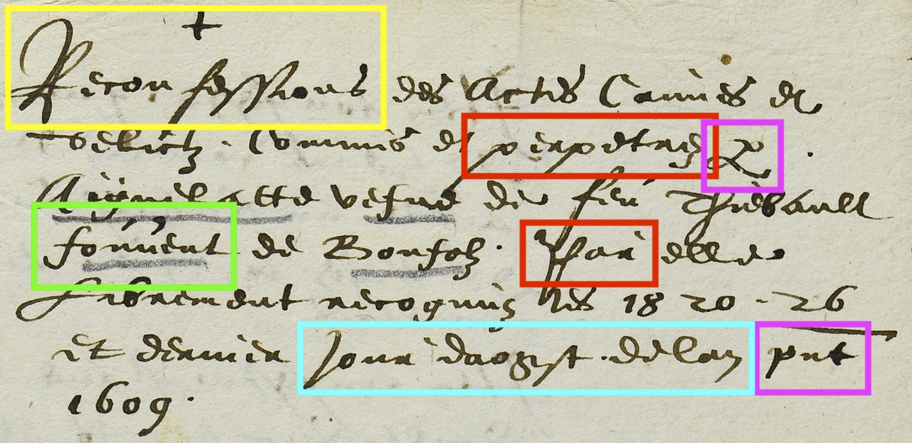

# Htériser une cursive du 17e siècle
> _Documents anciens et reconnaissance automatique des écritures manuscrites_
_23 juin 2022_

Élodie Paupe, Université de Neuchâtel – elodie.paupe@unine.ch
Chargée de projet auprès des AAEB (Jura, Suisse)


---
### Plan de la présentation
1. Introduction: le projet "Crimes et châtiments"
2. Le corpus
    1. Choix du corpus
    2. Présentation de la main
    3. Choix de transcription
    4. Intérêt du corpus
3. Retour d'expérience sur l'entraînement de modèles HTR
    1. Transkribus
    2. Kraken/FoNDUE
4. Conclusion et développements à venir 

---
# "Crimes et châtiments. Procès de sorcellerie et procédures criminelles: numérisation, mise en ligne et médiation"

---
## Cadre institutionnel 
* Archives de l'ancien Évêché de Bâle, fondation intercantonale (BE, JU, BL, BS) créée en 1985
* Fonds entre le IXe s. et 1815, parmi lesquels la plus ancienne charte conservée en original en allemand (1238-1239)
* Dossiers 
    * qui concernent le diocèse de Bâle et la principauté épiscopale
    * qui concernent l'administration française (dép. du Mont-Terrible et du Haut-Rhin 1793-1814)
    * en français, en allemand et en latin

---


---
## Projet de numérisation "Crimes et châtiments" (2022-2025)
* Corpus de procès criminels (documents de 1461-1797; 25 m. linéraires/~110'000 pages), parmi lesquels des dossiers relatifs à la chasse aux sorcières
* Axes du projet : 
    * inventorisation détaillée (cf. https://archives-aaeb.jura.ch/detail.aspx?id=223584)
    * numérisation des sources 
    * développement de modèles HTR
    * mise en ligne des numérisations et des transcriptions
    * médiation 
* Recherche de financement en cours 

---


---
# Le corpus

---
##  i. Choix du corpus

* 57 pages, soit environ 8'800 mots
* une seule main, celle du prévôt Farine actif entre 1580-1618 (plus de 3'500 documents tous fonds confondus)
* autres mains d'archivistes pour la numérotation


AAEB B 168/15-2.1 p. 1

---

AAEB B 168/15-2.3 p. 1

---

AAEB B 168/15-23.1 p. 1

---
## ii. Présentation de la main

AAEB B 168/15-10.3 p. 1

---
On peut également noter qu’il manque souvent un jambage au groupe "mm", comme dans le nom de famille Hämmerlin.

"Hämmerlin" avec six jambages     |"Hämmerlin" avec cinq jambages
---                               |---
   |
AAEB B 168/15-23.3 p. 2           |AAEB B 168/15-23.3 p. 1

---
## iii. Choix de transcription
* La transcription n’est pas allographétique. 
* Les lettres aux formes variables selon leur position dans le mot sont transcrites par une forme unique.
* Les majuscules se divisent en deux groupes:
    * celles qui ont une morphologie distincte de la lettre minuscule ne posent pas de problème (B, E, P, Q, R, S, T...).
    * celles qui ne se distinguent des minuscules que par la taille (A, C, D, G, V...) et sont donc difficiles à différencier. 

---
* Les <i/j> sont identiques et systématiquement sous forme majuscule au début d’un mot. Ils sont rendus sous leur valeur actuelle.
* Les abréviations sont toutes développées. 
* Les césures et apostrophes sont rendus d'après l'original.

---
## iv. Intérêt du corpus
* Histoire du droit: procédures criminelles
* Histoire, sociohistoire, _gender studies_: grand intérêt pour la question de la chasse aux sorcières
* Philologie: documents en langue d'oïl dans une région frontière (au sud, le franco-provençal; à l'est, le domaine germanique)
---
# Retour d'expérience sur l'entraînement de modèles HTR

---
## Deux outils testés 
* Transkribus 
* Kraken/FoNDUE
    ⇨ vendredi, 9h30, _FoNDUE – Mise en place d’une infrastructure eScriptorium à Genève_ par Simon Gabay

---
## Transkribus

---
### Retour d'expérience avec Transkribus
1. Entraîner un modèle à partir des données du seul corpus : 

Modèle     |Nombre de mots    |CER (set de validation)
---        |---               |---
AAEB_v2    |8'800 mots        |11%

---
2. Entraîner un modèle sur un modèle pré-existant (_fine tuning_) :

Modèle     |Nombre de mots    |Modèle de base               |Epochs   |CER (set de validation)
---        |---               |---                          |---      |---
AAEB_v4    |8'800 mots        |Charter Scripts XIII-XV_M1*   |100      |5.69%

*Modèle public développé par Tobias Hodel

---
### Résultat avec le modèle AAEB_v4


de mesme quicelui lui donnat **ung** du 
poulsat quest dedans du pappier aupres 
de la bouete de graisse, duquel, elle 
**deluoit** faire a mourir gens et bestes 
**lontesffois** quelle navoit encor fait 
a mourir **p drsonne** Mais quelle avoit 
fait a mourir les bestes suigvantes 

AAEB B168/15-10.2, p. 3.

---
3. Entraîner un modèle sur un modèle préexistant + le corpus avec les abréviations développées

Modèle        |Nombre de mots    |Modèle de base               |Epochs   |CER (set de validation)
---           |---               |---                          |---      |---
AAEB_ab_v1    |8'800 mots        |Charter Scripts XIII-XV_M1   |100      |4,68%

---
### Résultat avec le modèle AAEB_ab_v1


de mesme quicelui lui donnat **ung** du 
poulsat quest dedans du pappier aupres 
de la bouete de graisse, duquel, elle 
**de boit** faire a mourir gens et bestes 
**Contesfois** quelle navoit encor fait 
a mourir personne Mais quelle avoit 
fait a mourir les bestes suigvantes 

AAEB B168/15-10.2, p. 3.

---

AAEB B168/15-10.2 p. 1. 

---
AAEB_ab_v1                                          |AAEB_v4
---                                                 |---
**Du** 19 **daougst** 1609                          |**D** 19 **daougt** 1609
Aignelatte vefve de The fouvent de                  |Aignelatte vefve de The fouvent de 
Bonfolz estant chargee **par** la **Comune**        |Bonfolz estant chargee **p** la **Comme** 
**caive** et **reputation** de La plus grande       |**came** et **repuentx** de La plus grande 
**partie** de la Comunaulte **dudit Baisol**        |**ptie** de la Comunaulte **dud Baise**
A estee tiree en prison Sur precedentes             |A estee tiree en prison. Sur precedentes 
**informations** prinses, A estee interrogue        |**u formapt** prinses, A estee interrogue 
**ce jourdhi** matin. Laquelle na                   |**ceourdhoi** matin. Laquelle na
rien volsus cougnoistre                             |rien volsus congnoistre.

---
### Modèle testé sur des mains de la même époque


* Main de Nicolas Farine (1612)

WER     |CER    |Word Acc   |Char Acc
---     |---    |---        |---
68.02%  |29.81% |20.87%     |60.31%

---

* Main du Dr Faibvre (1612)

WER     |CER    |Word Acc   |Char Acc
---     |---    |---        |---
85.92%  |44.29% |8.15%      |42.87%

---
## Kraken/FoNDUE 

---
### Retour d'expérience 

1. Entraînement à partir des données du corpus sans modification de l'architecture : 

Modèle     |Nombre de mots    |Accuracy
---        |---               |---
AAEB_v1    |8'800 mots        |83,8%


--- 
### i. Tentative de binarisation (méthode Otsu)

Modèle         |Nombre de mots    |Accuracy
---            |---               |---
AAEB_bin_v1    |8'800 mots        |75,1%


---
### ii. [Modification de l'architecture d'apprentissage](https://kraken.re/master/ketos.html)

```
-s '[1,120,0,1 Cr3,13,32 Do0.1,2 Mp2,2 Cr3,13,32 Do0.1,2 Mp2,2 Cr3,9,64 
Do0.1,2 Mp2,2 Cr3,9,64 Do0.1,2 S1(1x0)1,3 Lbx200 Do0.1,2 Lbx200 Do.1,2 Lbx200 Do]' 
-r 0.0001
```

Modèle     |Nombre de mots    |Accuracy    |
---        |---               |---         |
AAEB_v1    |8'800 mots        |96,1%       |

Test set: 85,70%

---
```
=== report  ===

1559	Characters
223	Errors
85.70%	Accuracy

65	Insertions
29	Deletions
129	Substitutions

(...)

Errors	Correct-Generated
11	{ n } - {  }
10	{ e } - {  }
8	{ n } - { v }
7	{ i } - {  }
6	{  } - { i }
5	{ a } - { e }
5	{  } - { SPACE }
5	{  } - { u }
4	{ m } - { n }
```

---
# Conclusions

---
* Modèle développé sur Transkribus avec les données de la main du prévôt Farine satisfaisant grâce au _fine tuning_;
* Résultats insatisfaisants sur d'autres mains de la même époque: nécessité d'augmenter les données pour développer un modèle plus généraliste;
* Modèles développés avec Kraken moins satisfaisants, mais aucun _fine tuning_ n'a été réalisé. 

---
## Prochaines étapes 
Avec Transkribus: 
* créer de la vérité de terrain pour quelques mains bien représentées dans les fonds (Nicolas Farine, Dr Faibvre) ⇨ créer des modèles spécifiques
* à partir de ces données ⇨ créer un modèle générique;

Avec Kraken: 
* augmenter le volume de données d'entraînement ⇨ créer un modèle générique

Avec les documents en allemand: 
* poursuivre les tests avec les modèles déjà existants: résultats encourageants.

---

Modèle public développé par Tobias Hodel German Kurrent XVIth-XVIIIth

---
## Merci de votre attention !
